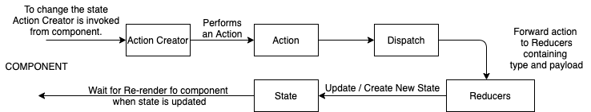

### Learnings

## Redux Cycle
   

## Purpose of index.js in action folder

  It eases the way of writing the import as below by skipping the file name.

    import actions from '../actions';

    Here web-pack automatically reference the index.js and is returned.

## Export for action creator:

  In place of default export we will use named export form action creator as the action creator might have multiple exports.
  ex:-

      export const fun_name = () => {

      };

## imports :

  When export default is used, at the time of import we do not need {} like below

    import fun_name from '../actions';

  But when named export is used, we must used braces i.e. {}

    import { fun_name } from '../actions';

## Provider

  - This tag is written at very top of the component hierarchy.
  - Provider has reference to the redux store that contains all the reducers.
  - ex -
    Inside index.js:-

      ReactDOM.render(
        <Provider store={createStore(reducers)}>
          <App />
        </Provider>,
        document.querySelector(#root)
        );

## Connect

  - This is used to connect with the provider and thus connect to the redux store which has all the data inside it.
  - It makes all the data and methods available as props inside a component using method "mapStateToProps"(Function name could be anything).

## Structure of connect()()
  Two braces signify that it is returning a function inside a function as shown below:

    function connect() {
      return function() {
        return 'Inside';
      }
    }

  If we do connect() - It does not print anything as it is returning a function.
  If we do connect()() - It will show 'Inside' as we accessed the returned function using another braces.
