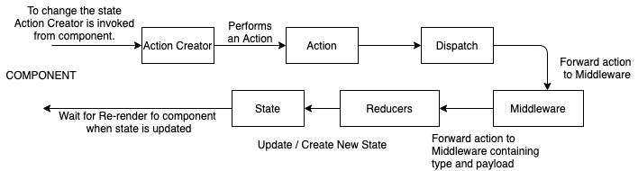
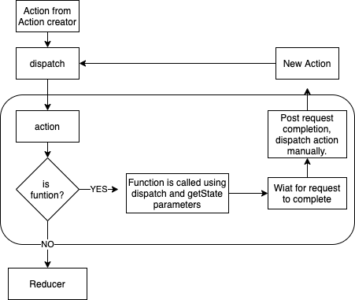

### Learnings

## Application Cycle with Middleware -

  

## Redux-Thunk - Middleware

  - It is a middleware that helps in making network request from the redux side of the application
  - It is a function that gets called every time we dispatch an action.
  - It can Modify, Stop, etc to actions.
  - Mostly Middleware generally used for handling async actions.
  - Redux Thunk - Allows to return a function from an action creator and redux thunk internally calls that function automatically with dispatch and getState arguments.
  - With this options, we have power to change or modify or read any data.
  - With Redux Thunk we can use Async Await.

  

##  Data Loading with Redux - Application Flow

  - 1. Initially the component is rendered on the screen.
  - 2. To fetch the data on the Application start, component life cycle method is used.
  - 3. 'componentDidMount' lifecycle method used which calls action creator.
  - 4. Action creator runs to make an API request
  - 5. On Successful call of API, data is returned as response.
  - 6. Action creator dispatched the data returned with type and payload containing the response data.
  - 7. Reducers defined specifically to handle the type of action, catches the request and store the payload data as state.
  - 8. As new state was generated using react-redux, it makes the application re-render with the new data using mapStateToProps method.

## Error While calling API from action Creator - "Actions must be plain objects. Use custom middleware for async actions."

  - The above error is because when we use async await it does not remain the plain javascript objects. To Check we can use online Babel Transpiler to check the JS object.
  - Also we just returned the jsonPlaceholder.get('/posts') rather than actually returning the response using the below code:-

  ```
    export const fetchPosts = async () => {

      const response = await jsonPlaceholder.get('/posts');

      return({
        type: 'FETCH_POSTS',
        payload: response
      });
    }

  ```

## Action Creators -

  - Synchronous action creator - Instantly runs and returns data without any delay.
  - Asynchronous action creator - Require some time to complete the API request and once the data is available, it returns the data.
